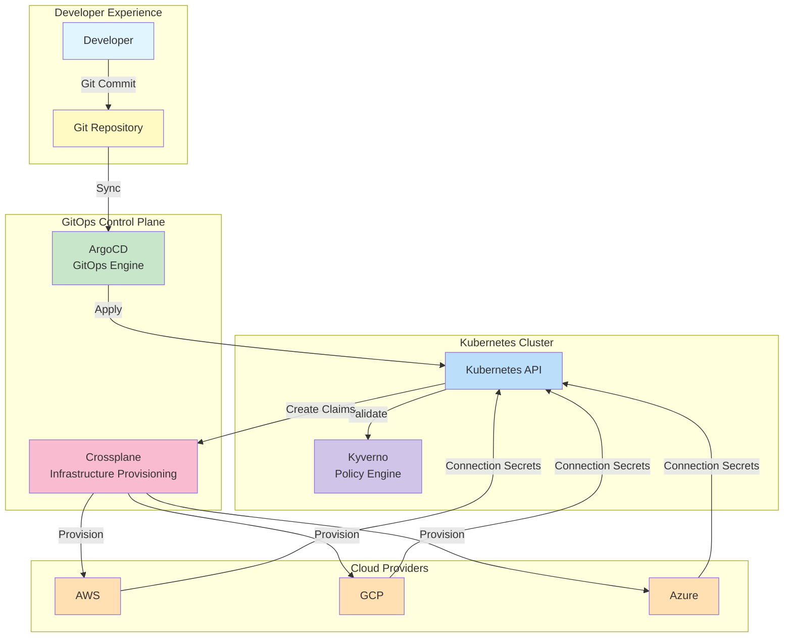
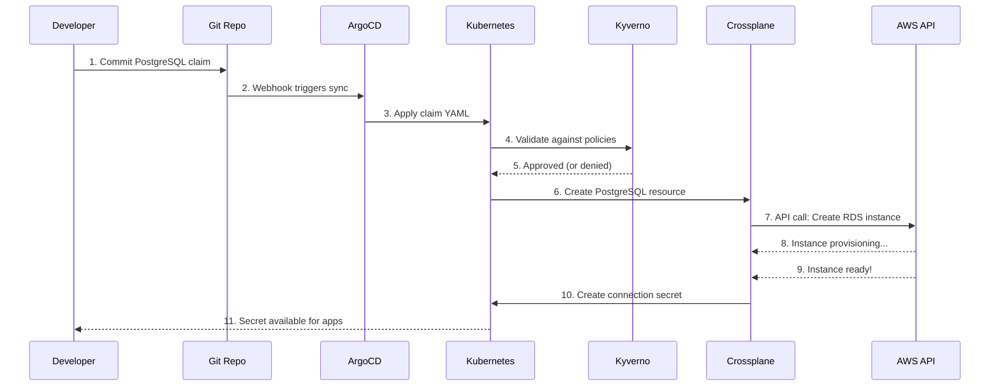
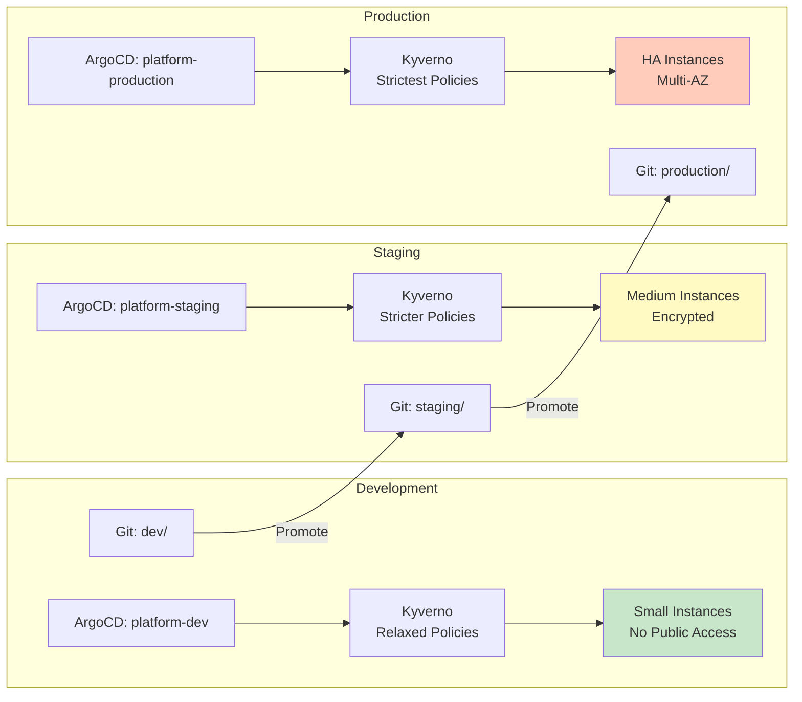
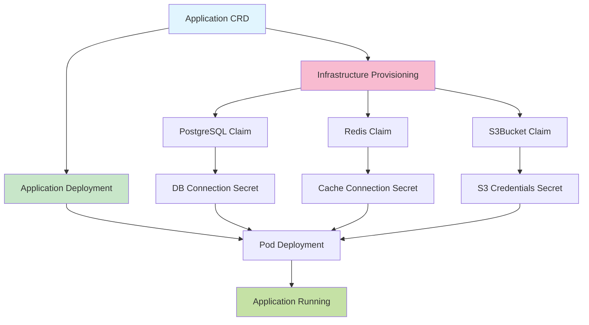
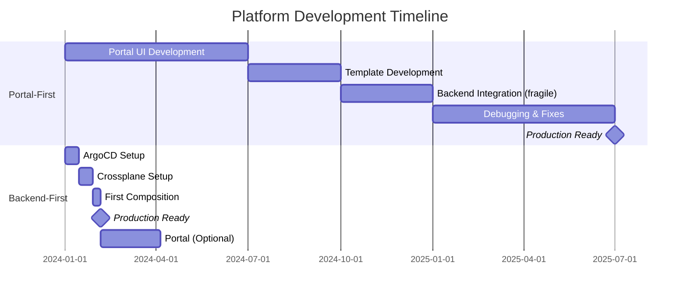
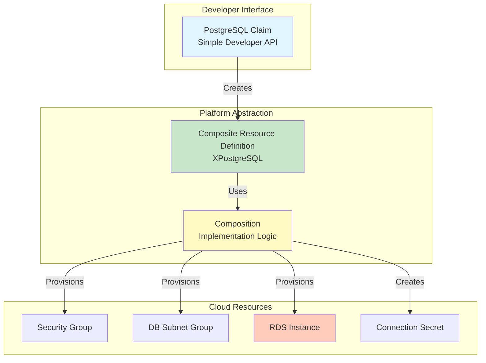
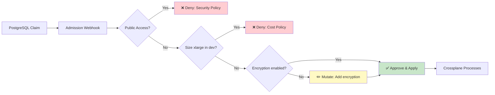
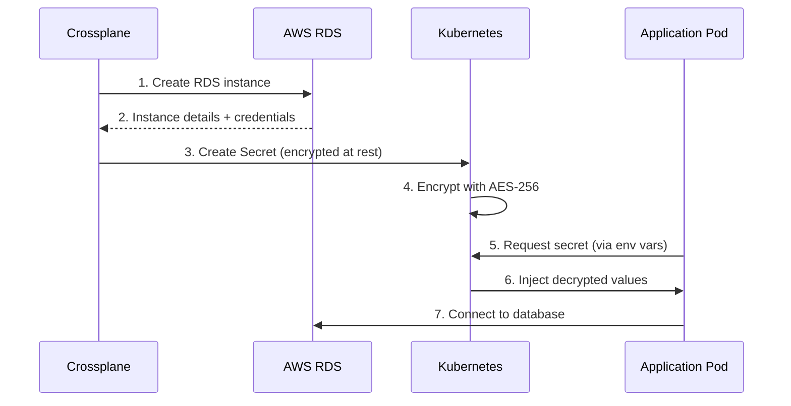
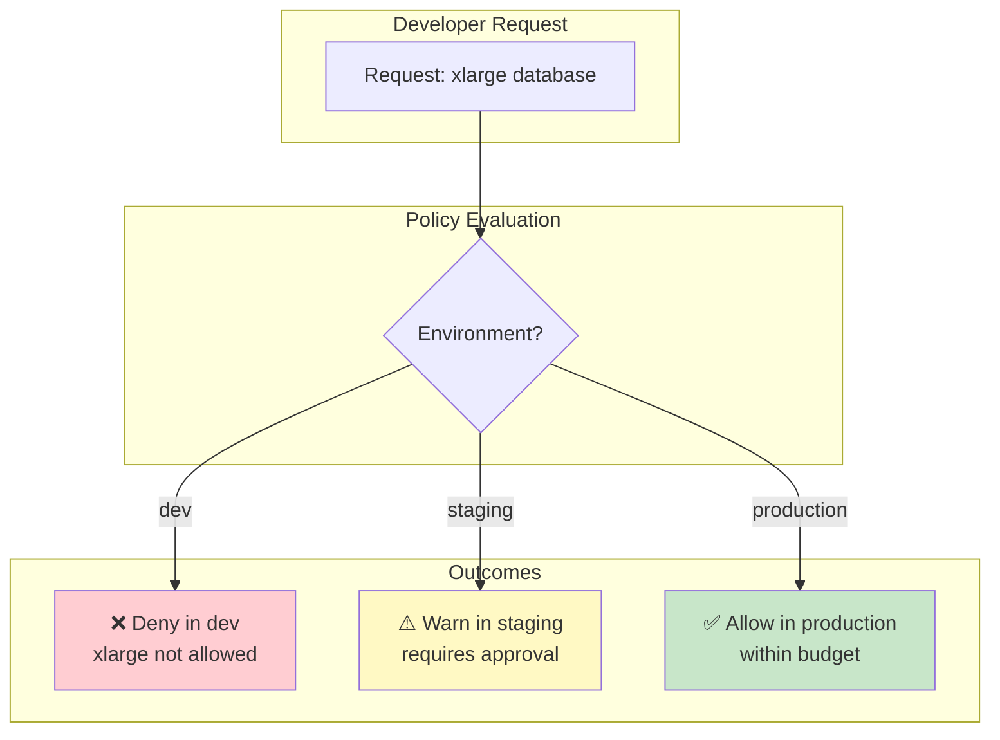
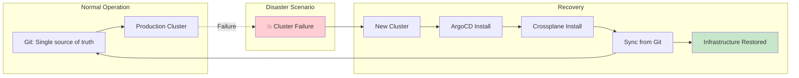

# Architecture Diagrams

Visual reference for understanding the Backend-First IDP architecture.

---

## 1. High-Level Architecture



**Key Components**:
- **Developer**: Writes YAML, commits to Git
- **ArgoCD**: Detects changes, syncs to cluster
- **Crossplane**: Provisions cloud infrastructure
- **Kyverno**: Enforces security and cost policies
- **Cloud Providers**: Create actual resources

---

## 2. Data Flow - PostgreSQL Provisioning



**Timeline**:
- Steps 1-6: ~30 seconds (GitOps)
- Steps 7-9: ~5-10 minutes (Cloud provisioning)
- Step 10-11: ~10 seconds (Secret creation)

---

## 3. Multi-Environment Flow



**Policy Differences**:
- **Dev**: Small sizes only, no delete protection, relaxed access
- **Staging**: Medium sizes, backup required, encrypted
- **Production**: HA required, multi-AZ, strict RBAC, audit logging

---

## 4. Application CRD Flow



**Magic of Application CRD**:
1. **ONE resource** defines entire stack
2. **Automatic secret wiring** - no manual env vars
3. **Dependency management** - infrastructure before app
4. **Cleanup coordination** - delete app deletes infrastructure

---

## 5. Portal-First vs Backend-First Comparison



**Key Insight**: Backend-First reaches production in 1-2 months vs 12-18 months for portal-first.

---

## 6. Crossplane Composition Architecture



**Abstraction Levels**:
1. **Claim**: What developer writes (5 lines of YAML)
2. **XRD**: Platform API definition (portable)
3. **Composition**: Cloud-specific implementation (AWS/GCP/Azure)
4. **Managed Resources**: Actual cloud resources (100+ resources created)

---

## 7. Policy Enforcement Flow



**Kyverno Policy Types**:
- **Validation**: Deny requests that violate rules (security, cost)
- **Mutation**: Auto-fix requests to add security defaults
- **Generation**: Auto-create supporting resources (network policies)

---

## 8. Secret Management Flow



**Security Layers**:
1. **Encryption at rest**: etcd encrypted with AES-256
2. **RBAC**: Only authorized pods access secrets
3. **Namespace isolation**: Secrets scoped to namespace
4. **Rotation**: External Secrets Operator (optional)

---

## 9. Cost Control Architecture



**Cost Policy Rules**:
- **Dev**: small/medium only ($85-320/month limit)
- **Staging**: up to large ($640/month, requires approval)
- **Production**: any size (budget tracking, alerts)

---

## 10. Disaster Recovery Flow



**Recovery Steps**:
1. Provision new Kubernetes cluster (15 min)
2. Install ArgoCD + Crossplane (10 min)
3. Point ArgoCD to Git repository (2 min)
4. ArgoCD syncs all resources (5 min)
5. Crossplane recreates infrastructure (10-20 min)
**Total**: ~45-60 minutes to full recovery

---

## Diagram Export

These diagrams are written in **Mermaid**, which renders automatically on GitHub, GitLab, and many documentation platforms.

### Rendering Locally

```bash
# Install mermaid-cli
npm install -g @mermaid-js/mermaid-cli

# Generate PNG
mmdc -i docs/ARCHITECTURE_DIAGRAMS.md -o docs/images/architecture.png

# Generate SVG
mmdc -i docs/ARCHITECTURE_DIAGRAMS.md -o docs/images/architecture.svg
```

### Tools that Render Mermaid

- **GitHub**: Automatic rendering in markdown
- **GitLab**: Automatic rendering
- **VS Code**: Install "Markdown Preview Mermaid Support" extension
- **IntelliJ/WebStorm**: Built-in support
- **Obsidian**: Built-in support
- **MkDocs**: Via mermaid2 plugin

### Online Editors

- https://mermaid.live/ - Live editor
- https://mermaid.js.org/ - Official documentation

---

## Additional Diagrams

For more specific diagrams, see:
- **Network Architecture**: `/docs/networking.md` (TODO)
- **Security Architecture**: `/docs/security-architecture.md` (TODO)
- **Scalability Patterns**: `/docs/scaling.md` (TODO)

---

**Questions about architecture?** See [FAQ.md](/docs/FAQ.md) or ask on Slack!
